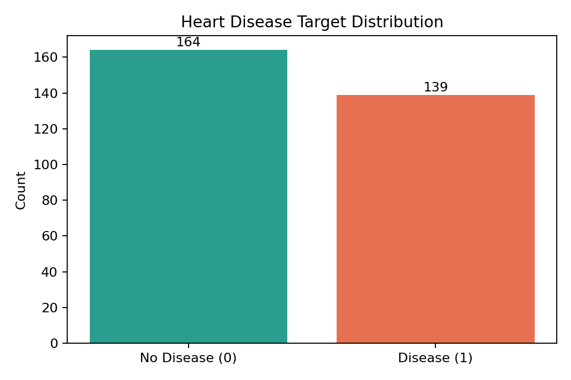
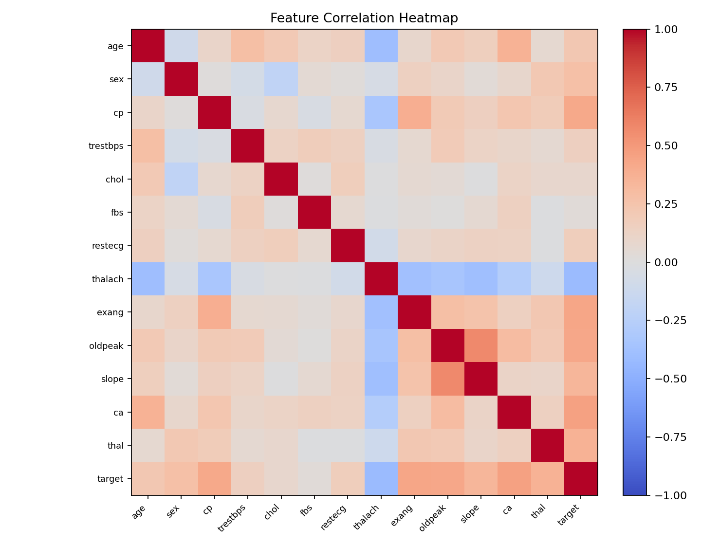
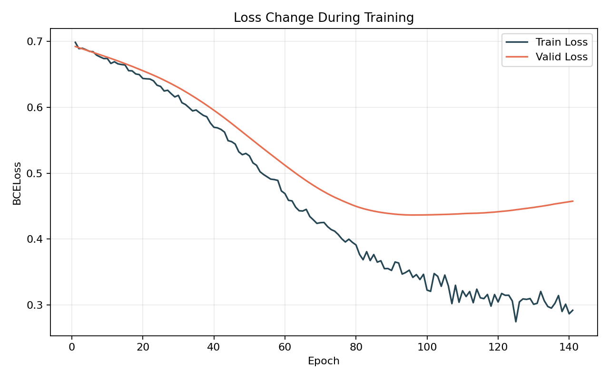
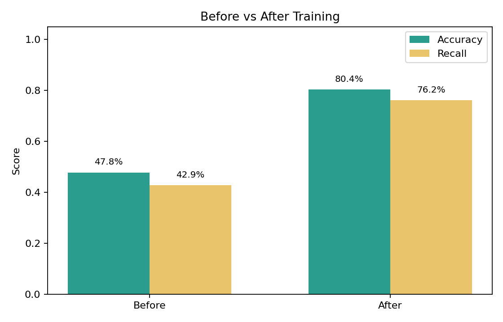

# 심장 질환 이진 분류 프로젝트

UCI Cleveland Heart Disease 데이터를 이용해 환자의 심장 질환 여부를 예측하는 이진 분류 프로젝트입니다.  
Pandas로 데이터를 전처리하고, PyTorch 기반 신경망 모델을 학습해 학습 전/후 성능을 비교했습니다.

## 프로젝트 목표

- 실제 의료 공개 데이터셋을 활용한 이진 분류 문제 해결
- 결측치 처리, 학습/검증/테스트 분리, 특징 표준화 과정 구현
- PyTorch로 심장 질환 예측 모델 학습
- 정확도, 정밀도, 재현율, F1-score, 혼동행렬로 성능 평가
- 학습 과정과 결과를 그래프 및 보고서 형태로 정리

## 사용 데이터

- 데이터셋: UCI Cleveland Heart Disease Dataset
- 참고 링크: https://archive.ics.uci.edu/ml/machine-learning-databases/heart-disease/processed.cleveland.data
- Kaggle 참고: https://www.kaggle.com/datasets/hartman/heart-disease-uci
- 샘플 수: 303개
- 입력 특징 수: 13개
- 정답 라벨: `0`은 정상, `1`은 심장 질환 있음

원자료의 `target` 값은 `0, 1, 2, 3, 4` 형태지만, 이 프로젝트에서는 이진 분류 목표에 맞춰 `0`은 정상, `1 이상`은 질환 있음으로 변환했습니다.

## 주요 기능

- CSV 데이터 로드 및 결측치 확인
- `ca`, `thal` 열의 결측치 중앙값 대체
- 학습/검증/테스트 데이터 분리
- 학습 데이터 기준 평균과 표준편차를 이용한 특징 표준화
- 클래스 분포 및 상관관계 시각화
- PyTorch 신경망 학습
- 학습 전 무작위 초기화 모델과 학습 후 모델 성능 비교
- 학습 손실, 검증 손실, 검증 정확도, 검증 재현율 그래프 저장

## 모델 구조

```text
입력 13개 특징
  -> Linear(13, 32)
  -> ReLU
  -> Dropout(0.25)
  -> Linear(32, 16)
  -> ReLU
  -> Linear(16, 1)
  -> Sigmoid
```

- 손실 함수: `nn.BCELoss`
- 최적화 함수: `Adam(lr=0.001)`
- 과적합 방지: Dropout, 검증 손실 기준 조기 종료

## 결과 요약

| 항목 | 값 |
| --- | ---: |
| 전체 데이터 | 303개 |
| 학습 / 검증 / 테스트 | 212 / 45 / 46 |
| 학습 전 테스트 정확도 | 0.4783 |
| 학습 후 테스트 정확도 | 0.8043 |
| 학습 후 테스트 재현율 | 0.7619 |
| 학습 후 테스트 F1-score | 0.7805 |
| 학습 후 테스트 손실 | 0.4386 |
| 실제 학습 epoch | 141 |

혼동행렬:

```json
{
  "tn": 21,
  "fp": 4,
  "fn": 5,
  "tp": 16
}
```

## 결과 이미지

### 클래스 분포



### 상관관계 히트맵



### 학습 손실 곡선



### 학습 전후 성능 비교



## 폴더 구성

```text
.
├── data/
│   ├── heart.csv
│   ├── heart_disease_raw.csv
│   ├── heart_clean.csv
│   ├── train.csv
│   ├── valid.csv
│   ├── test.csv
│   ├── normalized_train.csv
│   ├── normalized_valid.csv
│   ├── normalized_test.csv
│   └── normalization_info.csv
├── outputs/
│   ├── metrics.json
│   ├── result_summary.md
│   ├── heart_disease_model.pth
│   └── *.png
├── heart_disease_project.py
├── 프로젝트_심장질환_이진분류.ipynb
└── 기말프로젝트_완료보고서.md
```

## 실행 방법

Python 3 환경에서 필요한 패키지를 설치합니다.

```bash
pip install -r requirements.txt
```

그래프 창 없이 학습과 평가를 실행하려면 다음 명령어를 사용합니다.

```bash
python heart_disease_project.py --no-show
```

그래프 창을 함께 보고 싶다면 `--no-show` 옵션 없이 실행합니다.

```bash
python heart_disease_project.py
```

실행 결과는 `data/`와 `outputs/` 폴더에 저장됩니다.

## 사용 기술

- Python
- Pandas
- NumPy
- Matplotlib
- PyTorch

## 참고 사항

이 프로젝트는 인공지능개론 수업의 기말 프로젝트로 진행했습니다. 의료 진단용 모델이 아니라, 공개 데이터셋을 이용해 전처리, 이진 분류 모델링, 평가 흐름을 학습하기 위한 실습 프로젝트입니다.
